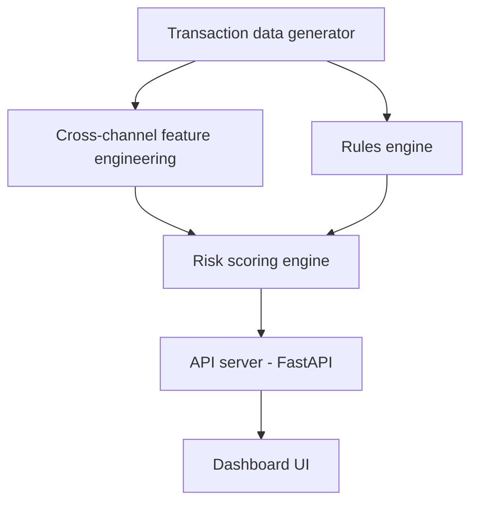
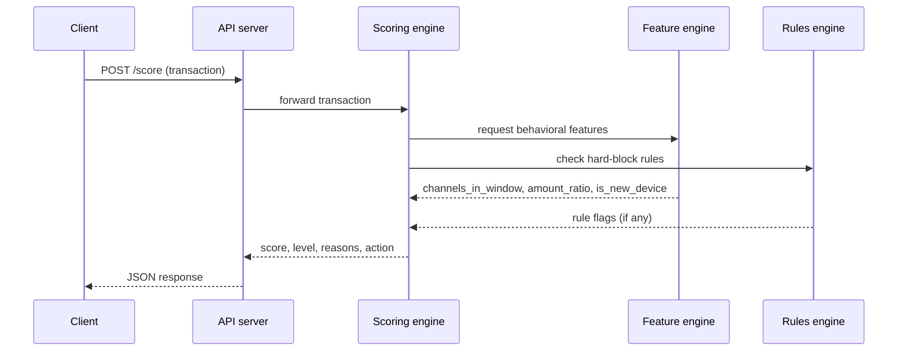
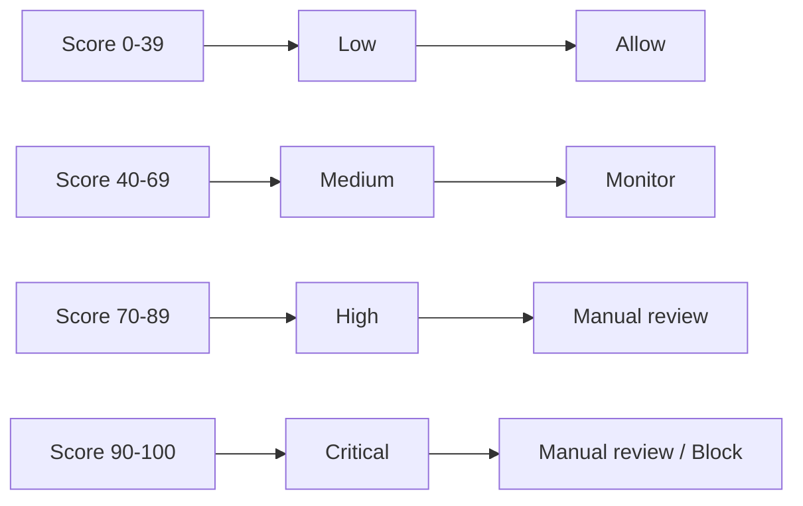
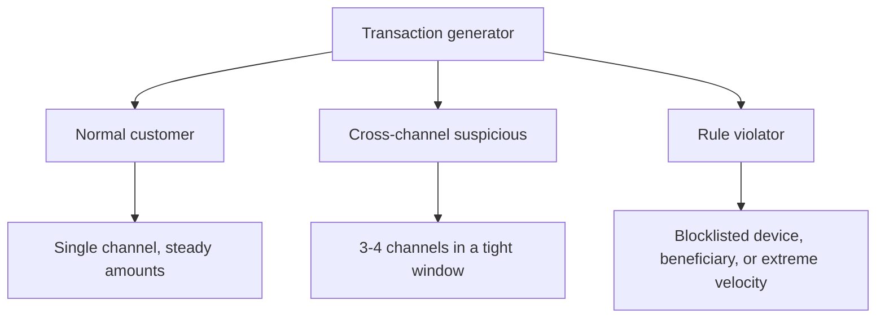

# Multi-Channel Fraud Risk Detection Engine

A fraud detection pipeline that scores financial transactions in real time by combining behavioral pattern analysis with a deterministic hard-rule engine, exposed through a REST API and visualized in a dashboard.

---

## Table of Contents

1. [Project Overview](#project-overview)
2. [What This Project Does](#what-this-project-does)
3. [Key Features](#key-features)
4. [System Workflow](#system-workflow)
5. [Request Lifecycle](#request-lifecycle)
6. [Score → Risk Level → Action](#score--risk-level--action)
7. [Synthetic Data Design](#synthetic-data-design)
8. [Project Structure](#project-structure)
9. [Tech Stack](#tech-stack)
10. [How Each Stage Works](#how-each-stage-works)
11. [Getting Started](#getting-started)
12. [Running the Full Pipeline](#running-the-full-pipeline)
13. [Sample API Contract](#sample-api-contract)
14. [Design Decisions](#design-decisions)
15. [Future Improvements](#future-improvements)
16. [License](#license)

---

## Project Overview

Banks and payment platforms process transactions across many channels at once — UPI, ATM, card, net banking. A fraudster rarely trips just one rule; they often move fast across channels, use a new device, or hit a beneficiary that's already known to be bad. Catching this requires two things working together: rules that instantly block obviously bad activity, and behavioral scoring that catches subtler patterns no fixed rule would anticipate.

This project builds both, wires them into a single risk score with human-readable explanations, and serves that score over an API so any front end can consume it.

## What This Project Does

Your system's job: take a stream of transactions, and for each one, spit out: 

- a risk score (0-100)
- a risk level (Low / Medium / High / Critical)
- plain-English reasons ("Blocklisted device", "Used 3 channels in 10 minutes")
- a recommended action (Allow / Monitor / Manual Review)

To get there, every transaction runs through this sequence:

1. Cross-channel behavioral features get computed (channel-hopping, unusual amounts, new devices).
2. Deterministic hard-block rules get checked (blocklisted device, blocklisted beneficiary, extreme velocity).
3. Both feed into a weighted score, which maps to a risk level and an action.
4. The result is served over an API and shown on a dashboard.

## Key Features

- **Synthetic data generator** that produces known customer archetypes — normal, cross-channel suspicious, and rule-violating — so the pipeline can be validated against data with a known right answer.
- **Cross-channel feature engineering** — detects customers using multiple payment channels within a suspiciously short time window.
- **Deterministic rules engine** — hard blocklists for devices and beneficiaries, plus velocity checks, independent of any score.
- **Weighted risk scoring** — configurable weights and thresholds combine behavioral signals and rule flags into a score, a risk level, and a recommended action.
- **Explainable output** — every score ships with plain-English reasons, not just a number.
- **REST API** (FastAPI) — real-time scoring endpoint any system can call.
- **Interactive dashboard** — color-coded risk levels with expandable reasons per transaction.

## System Workflow



## Request Lifecycle



## Score → Risk Level → Action



## Synthetic Data Design



## Project Structure

```
fraud-detection-engine/
│
├── generate_data.py            # synthetic transaction data generator
├── cross_channel_features.py   # behavioral feature engineering
├── rules_engine.py             # deterministic hard-block rules
├── scoring_engine.py           # combines features + rules into a score
├── api_server.py                # FastAPI wrapper around the scoring engine
├── ui/                          # dashboard front end
│
├── transactions.csv            # generated sample dataset
├── API_CONTRACT.md             # agreed shape of the API request/response
├── sample_request.json         # example payload for testing the API
└── README.md
```

## Tech Stack

| Layer | Technology |
|---|---|
| Data generation | Python, pandas, uuid, random |
| Feature engineering | Python, pandas |
| Rules engine | Python |
| Scoring engine | Python |
| API | FastAPI, Uvicorn |
| Dashboard | JavaScript / existing front-end codebase |

## How Each Stage Works

### Transaction data generator (`generate_data.py`)
Produces a CSV with columns: `transaction_id, customer_id, timestamp, channel, amount, location, device_id, beneficiary_id`, seeded with the three customer archetypes shown above.

### Cross-channel features (`cross_channel_features.py`)
Turns raw transactions into behavioral signals per transaction: `channels_in_window` (distinct channels used in a rolling time window, controlled by `CROSS_CHANNEL_WINDOW_MINUTES`), `amount_ratio_to_avg` (how unusual this amount is versus the customer's own history), and `is_new_device`. This stage only produces evidence — it doesn't decide anything.

### Rules engine (`rules_engine.py`)
Applies fixed checks: is `device_id` in `BLOCKLISTED_DEVICES`, is `beneficiary_id` in `BLOCKLISTED_BENEFICIARIES`, does this customer exceed `VELOCITY_MAX_TXNS`, or does the amount exceed `HARD_AMOUNT_CEILING`. Any hit produces an immediate `HARD_BLOCK` with a specific reason.

### Scoring engine (`scoring_engine.py`)
Combines the behavioral features and rule flags using configurable `WEIGHTS`, producing a numeric `risk_score`, a `risk_level`, a list of `reason_codes`, and a recommended `action`.

### API server (`api_server.py`)
A FastAPI app exposing:
- `GET /health` → `{"status": "ok"}`
- `POST /score` → accepts one or more transactions as JSON, returns their risk scores.

Interactive docs are auto-generated at `/docs` when the server is running.

### Dashboard UI (`ui/`)
Consumes the `/score` endpoint and renders a table: a risk score badge, a color-coded risk level, an expandable list of reasons, and a recommended action per transaction.

## Getting Started

Prerequisites: Python 3.10+, pip.

```bash
git clone https://github.com/<your-username>/<your-repo>.git
cd <your-repo>
pip install pandas fastapi uvicorn
```

## Running the Full Pipeline

```bash
# 1. Generate synthetic transaction data
python generate_data.py --rows 800 --output transactions.csv

# 2. Sanity-check cross-channel features
python cross_channel_features.py transactions.csv

# 3. Sanity-check the rules engine
python rules_engine.py transactions.csv

# 4. Sanity-check the combined scoring engine
python scoring_engine.py transactions.csv

# 5. Start the API
uvicorn api_server:app --reload --port 8000
# then open http://localhost:8000/docs

# 6. Test the API with a real payload
python -c "
import pandas as pd, json
df = pd.read_csv('transactions.csv').head(10)
print(json.dumps(df.to_dict('records')))
" > sample_request.json

curl -X POST http://localhost:8000/score -H "Content-Type: application/json" -d @sample_request.json
```

## Sample API Contract

```json
{
  "transaction_id": "a31fd7aa",
  "customer_id": "cust_susp_007",
  "risk_score": 92,
  "risk_level": "Critical",
  "reason_codes": [
    "3 channels used within 4 minutes",
    "Amount 3.1x higher than customer average",
    "Transaction from a new device"
  ],
  "action": "Manual review"
}
```

## Design Decisions

Rules alone are fast and unambiguous but brittle — they only catch what someone explicitly thought to write a rule for. Scoring alone is more flexible but harder to reason about and explain. Combining them means known-bad patterns get an instant, explainable hard block, while everything else still gets evaluated on a nuanced, weighted score — and every decision ships with reasons instead of being a black box.

## Future Improvements

- Replace static rule thresholds with values learned from historical fraud labels.
- Add a real-time streaming ingestion layer instead of batch CSV input.
- Persist scored transactions to a database for analyst audit trails.
- Add authentication to the API before any production use.

## License

MIT — see `LICENSE` for details.
